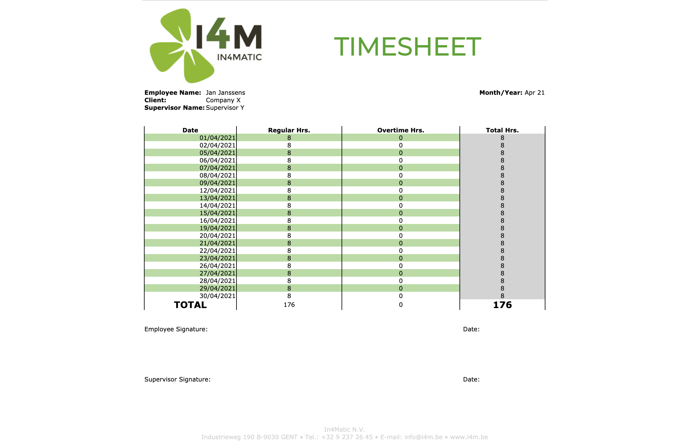
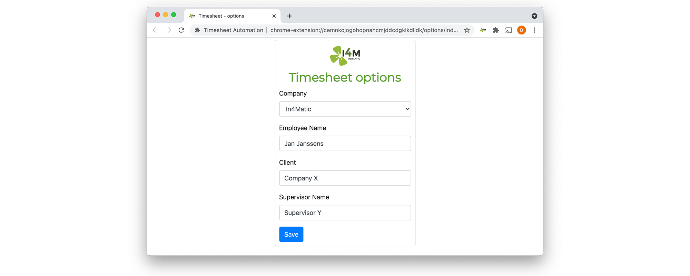

# In4Matic - Timesheet Automation

Timesheet automation is a Chrome Extension that automatically generates a timesheet based on the current Officiënt calendar.

## Installation - Chrome Web Store

Follow the URL: https://chrome.google.com/webstore/detail/timesheet-automation/debngnappjjakbkdhgpfaalipidjkgbj

Click on `Add to Chrome`

Click on `Add Extension`

## Usage

After installation a new tab will open. In this tab, you can set the default values for the generated timesheet and click on `Save`.

### Automatically navigate to Officiënt

`Click on the extension` in the navigation bar and click on the button `Officient calendar`.

Officiënt will open in a new tab. After logging in, it will automatically navigate to the Officiënt calendar.

### Generate timesheet

`Click on the extension` in the navigation bar when the Officiënt calendar tab is active. A timesheet will automatically be generated based on the off days from the calendar.

The timesheet can be edited and printed for signing afterwards.

### Options

The default values of the timesheet can be changed at all times by `right-clicking on the extension` in the navigation bar and clicking `options`.

